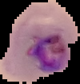
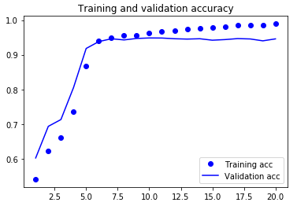
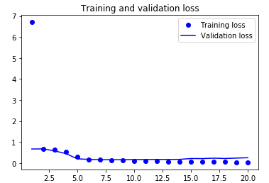

# Identificação de células infetadas com malária através de redes neuronais convolucionais

Aplicação de redes neuronais convolucionais à identificação da preseça do parasita da malária em células humanas

## Conteúdo

- **[Redes Neuronais Convolucionais](#redes-neuronais-convolucionais)**
- **[Dataset Utilizado e pré-processamento](#dataset-utilizado-e-pré-processamento)**
- **[Arquitetura e algoritmos utilizados](#topologia-utilizada)**
-  **[Resultados obtidos](#resultados-obtidos)**

## Redes Neuronais Convolucionais

Redes Neuronais convolucionais são uma subclasse de redes Neuronais que obtém resultados excelentes em problemas que envolvam processamento e identificação de imagens.
 Estes resultados devem-se à utilização de dois tipos de layers específicos:

 - **Layers de convolução**.  Layers responsáveis por aplicar filtros à imagem. Estes filtros tentarão salientar aspetos chave da imagem como, por exemplo, traços horizontais/ verticais. Vários layers convolucionais consecutivos conseguirão salientar padrões cada vez mais complexos. No contexto do nosso projeto os filtros irão começar a salientar aspetos da célula que indiquem se ela está infetada.

 -  **Layers de pooling**. Layer que irá reduzir o tamanho da imagem. Um método bastante utilizado é o maxPooling em que entre 2 pixeis se mantém apenas o que contém maior valor. A utulidade desta layers está no facto de que quando reduzimos o tamanho da imagem, podemos focar cada imagem num aspeto distinto da imagem
 
 
A parte final de uma rede neuronal convolucional é composta por algumas layers densamente ligadas para que a rede aprenda a quais aspetos das imagens deve dar importância.

## Dataset utilizado e pré-processamento

O dataset utilizado encontra-se presente neste repositório, mas foi originalmente criado por cientistas do Lister Hill National Center for Biomedical Communications (LHNCBC). Foi originalmente publicado [aqui](https://lhncbc.nlm.nih.gov/publication/pub9932)

O dataset encontra-se separado entre células não infetadas e células já parasitadas. 
  
 **Célula não infetada**
 
 
 
 **Célula Infetada**
 
 
 
Este foi posteriormente separado em imagens para treino e para validação e teste da rede neuronal. As imagens foram ainda normalizadas (os valores dos seus píxeis foram reduzidos a intervalos entre 0 e 1) para facilitar o treino da rede.

Estas imagens processadas foram gravadas no formato .pickle para permitir maior facilidade em carregar os dados.

## Topologia e algoritmos utilizados

A topologia de uma rede neuronal corresponde à arquitetura das suas layers. No caso da nossa rede convolucional, a arquitetura utilizada foi a seguinte :
      - 4 Layers de convuolução de 32 e 64 filtros intercaladas com layers de pooling2D 
      - 2 Layers ligadas densamente, sendo a última destas duas respionsável por indicar se a célula se encontra infetada por malária

A função de ativação das layers foi sempre rectified linear unit(ReLu), à exceção da última, que apresenta uma função sigmoid, utilizada no cálculo de probabilidades.
O algoritmo de otimização foi o adam, algoritmo que de momento apresenta melhores resultados para este tipo de tarefa e a função de loss utilizada foi a binary_crossentropy, devivo a tratar-se de um problema de classificação binária (está ou não está infetada).

A seguinte imagem representa uma rede neuronal semelhante à utilizada, com a mesma topologia.

## Resultados obtidos

Após afinar vários parâmetros e treinar a rede neuronal por 20 épocas, atingiu-se uma taxa de previsão de 95%, tanto nos dados de validação como nos de teste, pelo que este parece ser limite para uma rede que siga este tipo básico de arquitetura. 

**Gráfico da taxa de previsão ao longo das épocas de treino**

**Gráfico da loss ao longo do treino**

